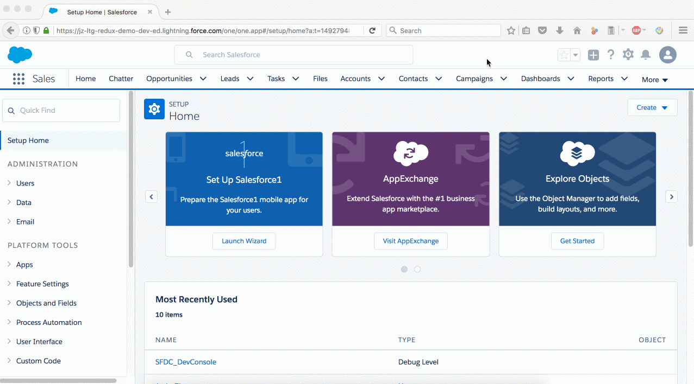

# reference

* [Lightning Components and Redux: A Predictable State Container for Lightning Apps](https://www.youtube.com/watch?v=94ZkxJX3w_0)

* [forked from madmax983/lightning-redux](https://github.com/jacky1999cn2000/lightning-redux)
  * Very detailed explanation in the project's README.md
  * Pay attention to the gulpfile

* Components from the Forked GitHub Project were deployed to this org:
  * URL: jz-ltg-redux-demo-dev-ed.my.salesforce.com
  * username: sfdc-ltg-redux@jz.com
  * password:
  * token: AElWoWb6wvWTCJoamCxN5SftY

