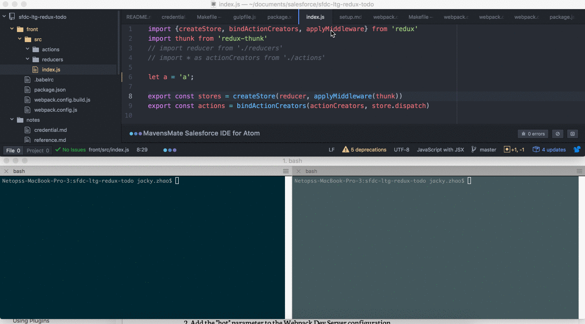

# setup

* Makefile - we will run two separate containers
  ```
  front_bash:
  	cd front && docker run -it --rm -v `pwd`:/usr/src/app -w /usr/src/app --entrypoint="bash" node:5

  app_bash:
  	docker run -it --rm -v `pwd`:/usr/src/app -w /usr/src/app --entrypoint="bash" node:5
  ```

* `front_bash` container (this container used `webpack-dev-server` to dynamically compile `bundle.js` file while we change anything under `./front/src`)
  * usage
    * run `npm install` if not already done so
    * run `npm start` to start `webpack-dev-server`

  * explanation
    * this part of setup is almost identical to [sfdc-streaming-api](https://github.com/jacky1999cn2000/sfdc-streaming-api-demo), however, there are some differences
    * when we use `webpack-dev-server`, the build folder wont be created until we make a production deploy configuration. While in development, all the bundled files and the generated HTML will be served from memory.[refer to this](http://www.pro-react.com/materials/appendixA/)
    * this means that even though we could see `bundle.js` content via `localhost:8080/bundle.js`, the content is actually served from memory and not generated yet; this is okay for project `sfdc-streaming-api` since it would used `ngrok` to redirect a generated https url to `localhost:8080`, so the content served from memory can be reflected in its VF page.
    * however, we used Lightning component rather than VF page for this project, and in Lightning component we have to use static resource to import a javascript file. Thus, we need to create a static resource file based on `bundle.js` file and upload it to developer org.

* this is where `app_bash` container comes into the picture (this container used `gulp` to perform all kinds of development/deployment tasks)
  * development task (generate/deploy static resource)
    * usage
      * run `npm install` if not already done so
      * run `npm install -g gulp` to install `gulp` globally in the container
      * run `gulp develop` to generate/upload static resource based on bundle.js

    * explanation
      * `develop` task would run `develop:staticresource-generate` task and `develop:staticresource-upload` sequentially
      * the former task would use `webpack.config.build.js` to generate `bundle.resource` file based on `bundle.js` file (assuming there is no compile errors in `front_bash` container)
      * the latter task would use `gulp-jsforce-deploy` to upload static resource (and other metadata, based on package.xml) to designated org (in this case, the developer org)


